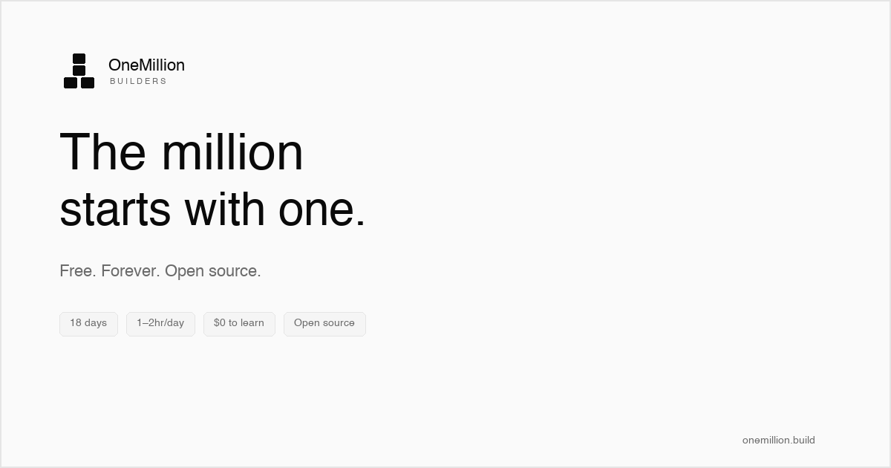

# teach-one-million

*Teaching 1,000,000 people to build real products with AI. Free. Forever.*

*By [Sid Dixit](https://www.linkedin.com/in/siddharthdixit/)*

---

The million starts with one.

That one could be you.

---

| | |
|--|--|
| [onemillion-builder →](onemillion-builder/README.md) | 18-day course — build a real AI product from scratch |
| [onemillion-plugin →](onemillion-plugin/README.md) | Spec-driven AI development for your IDE |
| [The Manifesto →](MANIFESTO.md) | Why the CS degree is dead |
| [Builder Wall →](builders/README.md) | Everyone who finished |
| [Join a Cohort →](cohort/README.md) | Free, live, Sid-led |

---

*MIT licensed. Free for learners, forever.*
*→ [onemillion.build](https://onemillion.build)*
