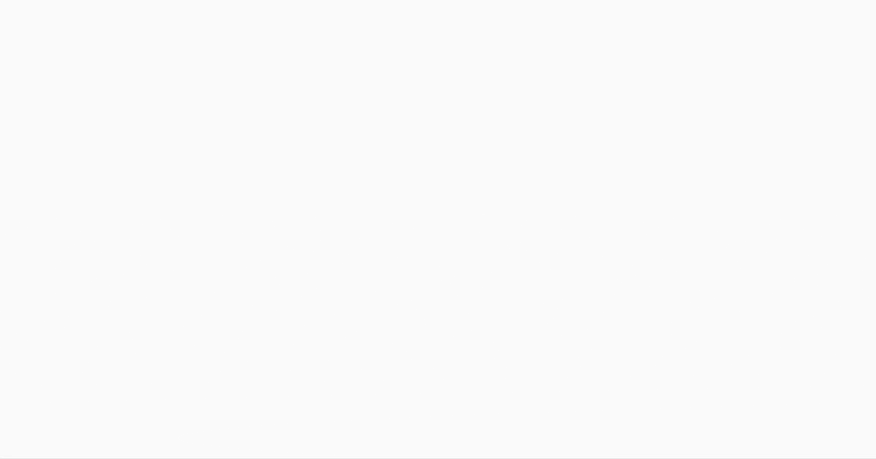
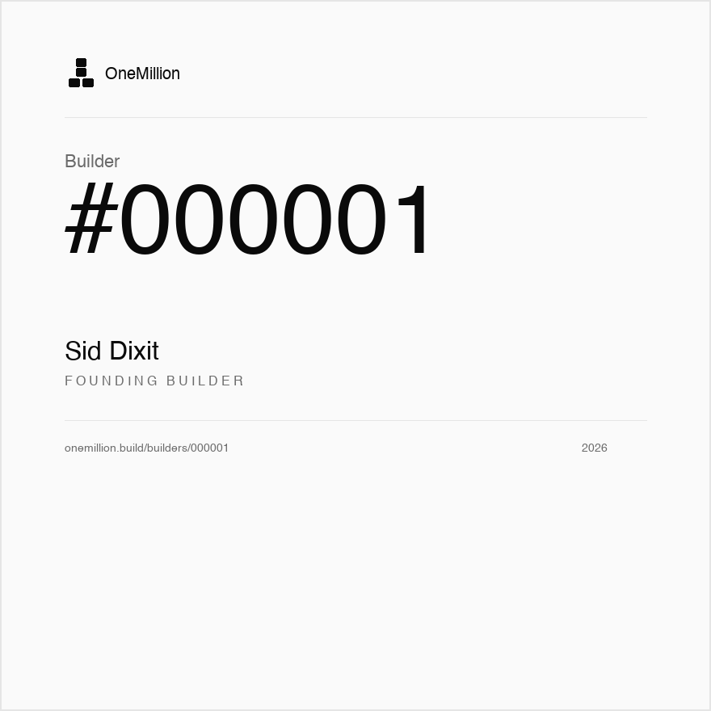

# OneMillion Builder

<p align="center">
  
</p>

<p align="center">
  <strong>Build and ship a real AI product in 18 days.</strong><br>
  Beginner-friendly. Agent-guided. Free forever.
</p>

<p align="center">
  <a href="START-HERE.md"><strong>Start Here</strong></a>
  &nbsp;•&nbsp;
  <a href="#start-in-5-minutes">5-Minute Setup</a>
  &nbsp;•&nbsp;
  <a href="#course-roadmap">Course Roadmap</a>
  &nbsp;•&nbsp;
  <a href="docs/FAQ.md">FAQ</a>
</p>

<p align="center">
  
  
  
</p>

---

## The Promise

Most people get stuck because they try to learn coding, product thinking, AI, deployment, auth, databases, and launch all at once.

OneMillion turns that into one small daily move.

By the end, you have:

| You ship | Proof you keep |
|---|---|
| A live web app | Public Vercel URL |
| Real signup/login | Supabase auth + database |
| A real AI feature | Claude-powered workflow |
| Production hygiene | Security, monitoring, and checks |
| A public demo | Loom + Builder Claim |

No prior coding experience required. Your coding harness becomes your teacher, but you make the decisions and learn the tools.

---

## Start In 5 Minutes

The course starts from your own fork. That matters: your fork becomes your learning workspace, progress trail, and final proof.

| Step | Do this | Link |
|---:|---|---|
| 1 | Star the repo | [Open repo](https://github.com/siddsdixit/teach-one-million) |
| 2 | Fork it into your GitHub account | [Fork now](https://github.com/siddsdixit/teach-one-million/fork) |
| 3 | Clone your fork | Use the command below |
| 4 | Run the installer | It checks/fixes `origin` and `upstream` |
| 5 | Paste the start prompt | Claude Code, Cursor, Codex, Gemini, Antigravity, Copilot |

```bash
git clone https://github.com/YOUR-USERNAME/teach-one-million.git
cd teach-one-million
./onemillion-builder/install-agents.sh
```

Then paste this into your coding harness:

```text
I am starting the OneMillion course from my fork.

Read AGENTS.md and onemillion-builder/course-manifest.json.
Become my OneMillion learning orchestrator.
First enforce the Preflight Gate. If anything is wrong with clone/fork/origin/upstream setup, stop and fix it before Day 0.
Then start Day 0 and Day 1.
Teach me one day at a time.
When I say "day done", verify the day and advance me.
Do not skip the learning or do the external tool steps for me.
```

Need the slower walkthrough? Open [START-HERE.md](START-HERE.md).

---

## How The Course Feels

|  |  |
|---|---|
| **Short daily lessons** | Read just enough to understand the idea before building. |
| **Hands-on building** | Your harness writes code with you, but you review and decide. |
| **Real tools** | GitHub, Vercel, Supabase, Anthropic, Sentry, Loom. |
| **Daily verification** | Say `day done`; your harness checks the gate before moving on. |

The rule:

```text
Agent guides.
Learner decides.
Learner touches real tools.
Agent verifies.
```

Whenever the course asks you to create an account, API key, dashboard setting, or public link, use the [Account Setup Playbook](docs/account-setup.md). It gives the exact link, exact permission, and exact QA check.

---

## Course Roadmap

| Stage | Days | What you learn | What you have at the end |
|---|---:|---|---|
| **Foundation** | 1-6 | Idea, PRD, stack, GitHub, Vercel, Supabase | A live app with auth, database, and one core feature |
| **Make It AI** | 7-12 | AI spec, Claude API, streaming, tools, RAG, quality gates | A real AI feature inside your product |
| **Ship & Sell** | 13-18 | Security, monitoring, landing page, outreach, demo | A launch-ready product and Builder Claim |

<p align="center">
  <a href="week-1-foundation/README.md"><strong>Week 1: Foundation</strong></a>
  &nbsp;•&nbsp;
  <a href="week-2-make-it-ai/README.md"><strong>Week 2: Make It AI</strong></a>
  &nbsp;•&nbsp;
  <a href="week-3-ship-and-sell/README.md"><strong>Week 3: Ship & Sell</strong></a>
</p>

---

## Daily Path

| Day | Focus | Outcome |
|---:|---|---|
| [0](day-0-commit/README.md) | Public commitment + GitHub setup | Fork, clone, and commit to finishing |
| [1](week-1-foundation/day-01-vision/learn.md) | Vision + mental map | Pick the product direction |
| [2](week-1-foundation/day-02-problem/learn.md) | Problem + Mom Test | Validate pain before writing code |
| [3](week-1-foundation/day-03-prd/learn.md) | PRD | Lock the MVP scope |
| [4](week-1-foundation/day-04-stack/learn.md) | Stack + first deploy | Next.js app live on Vercel |
| [5](week-1-foundation/day-05-auth/learn.md) | Auth + database | Supabase signup/login + first table |
| [6](week-1-foundation/day-06-core-feature/learn.md) | Core feature | Main workflow working end-to-end |
| [7](week-2-make-it-ai/day-07-ai-spec/learn.md) | AI feature spec | Measurable AI behavior |
| [8](week-2-make-it-ai/day-08-first-ai-call/learn.md) | First AI call | Claude output in your app |
| [9](week-2-make-it-ai/day-09-streaming/learn.md) | Streaming UI | Token-by-token response UI |
| [10](week-2-make-it-ai/day-10-tool-use/learn.md) | Tool use | AI reads or writes scoped app data |
| [11](week-2-make-it-ai/day-11-rag/learn.md) | RAG | AI grounded in user data |
| [12](week-2-make-it-ai/day-12-lock-the-ai/learn.md) | Quality gates | Tests, evals, and cost budget |
| [13](week-3-ship-and-sell/day-13-hygiene/learn.md) | Production hygiene | Security and secrets audit |
| [14](week-3-ship-and-sell/day-14-domain/learn.md) | Domain | Custom domain or documented skip |
| [15](week-3-ship-and-sell/day-15-monitoring/learn.md) | Monitoring | Sentry, analytics, uptime |
| [16](week-3-ship-and-sell/day-16-landing/learn.md) | Landing page | Clear public product page |
| [17](week-3-ship-and-sell/day-17-first-users/learn.md) | First users | Outreach and feedback |
| [18](week-3-ship-and-sell/day-18-demo/learn.md) | Demo Day | Loom demo + Builder Claim |

---

## What You Need

| Need | Notes |
|---|---|
| Laptop | Mac, Windows, or Linux |
| Coding harness | Claude Code, Cursor, Codex, Gemini, Antigravity, Copilot, or similar |
| GitHub | Source control and proof trail |
| Vercel | Deployment |
| Supabase | Auth and database |
| Anthropic API key | Added in Week 2 |
| Time | 1-2 hours per day |

---

## What You Earn

Complete all 18 days, pass final verification, and submit your Builder Claim.

| Credential | What it means |
|---|---|
| **Builder #N** | A sequential, permanent builder number after review |
| **Public proof** | Live URL, demo Loom, daily verification reports |
| **Reusable skill** | A repeatable agentic build process for your next product |

See [How Builder #N is earned](docs/verification/README.md).

<p align="center">
  
</p>

---

## Helpful Links

| I need... | Go here |
|---|---|
| The full start guide | [START-HERE.md](START-HERE.md) |
| Account links and permissions | [Account Setup Playbook](docs/account-setup.md) |
| Harness-specific setup | [Harness Guides](docs/harnesses/README.md) |
| Help after a break | [Recover Your Place](docs/recover.md) |
| Verification details | [Verification](docs/verification/README.md) |
| Common questions | [FAQ](docs/FAQ.md) |
| Example finished artifacts | [DeliverableDash Example](docs/examples/deliverabledash/README.md) |

---

<p align="center">
  <strong>The million starts with one.</strong><br>
  <a href="START-HERE.md"><strong>Start Day 0</strong></a>
</p>

---

MIT licensed. Free for learners, forever.
